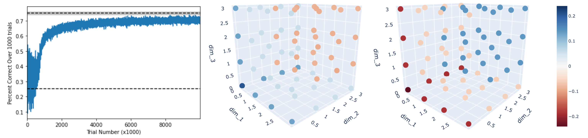

# Overview

The Wisconsin Card Sorting Test is a task designed to analyze individuals cognitive ability, planning, generalization ability, and decision making. In analyses on monkeys and humans performing a variation of the task (publication soon!), monkeys perform the task with a reinforcement learning framework while humans perform like a memory-limited optimal agent.

With this in mind, how does a reinforcement learning (RL) agent solve this task?\
How well can an RL agent perform?\
And what insights can be found about real subject performance given the RL performance?

There are many ways to implement RL agents to solve this task. I begin with the most naive approach and gradually build complexity. By the end, I implement a Recurrent Neural Network (RNN), which directly learns the task structure.

# Results

See RL-WCST-Demo.ipynb for full RL exploration

- RNN's are able to learn the structure of the task: The weights can be frozen, and the agent will still perform the task well.
- RNN's can find task structure with NO knowledge of the importance of features. That is, it can learn only information about the chosen stimuli. While taking longer to train, information about one card spreads to all other cards in a way that resembles learning of features.
- The best agent (thus far) uses a different network of weights for correct and incorrect trials, showing slight differences in how values are updated.
- The best agent (thus far) performs close to the optimal agent. In general, it performs at the level of a human participant (not shown, but stay tuned for the afforementioned publication on monkeys and humans performing this task!).
- The RNN agent learns to update the hidden values on every trial based on chosen cards (in a feature based way), and it spreads information from each hidden value to all other hidden values. In this way, information can be broadened to all stimuli.

# Files

- RL-WCST-Demo.ipynb: Full RL exploration
- manually_run_wcst.ipynb: Example notebook for manually playing the task yourself
- run_optimal_agent.ipynb: Notebook for running the optimal agent
- agents.py: All RL agents and their architectures
- tools.py: A collection of random tools used throughout these notebooks
- optimal_agent.py: The optimal agent architecture
- WCST.py / card_generators.py / rule_generators.py: notebooks necessary for running the task

# Notes

- The WCST environment was adapted and simplified from code by Patrick Zhang here: https://github.com/learning-2-learn/wcst_engine